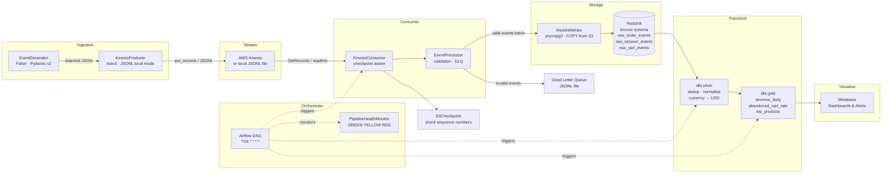

# Real-Time E-Commerce Analytics Pipeline

A production-ready Python project simulating a Kinesis + Kinesis → Redshift → dbt → Metabase stack for real-time e-commerce analytics.

## Architecture



## Event Schemas

Three Pydantic v2 models:

| Model | Key Fields |
|---|---|
| `OrderEvent` | `order_id`, `items[]`, `currency`, `total_amount`, `payment_method` |
| `SessionEvent` | `session_id`, `page_url`, `device_type`, `referrer` |
| `CartEvent` | `cart_id`, `product_id`, `quantity`, `unit_price` |

## Quickstart (Local Mode: Zero AWS Needed)

### 1. Install dependencies

```bash
cd ecommerce-realtime-pipeline
pip install pydantic faker structlog duckdb pytest pytest-cov pytest-mock psycopg2-binary boto3
```

### 2. Generate sample data

```bash
python - <<'EOF'
from pathlib import Path
from producer.event_generator import EventGenerator
gen = EventGenerator(seed=42)
gen.write_sample_data(Path("data/sample_events"), n_orders=1000, n_sessions=5000, n_carts=3000, seed=42)
EOF
```

Files written to `data/sample_events/`:
- `order_events.jsonl`: 1 000 order events
- `session_events.jsonl`: 5 000 session events
- `cart_events.jsonl`: 3 000 cart events

### 3. Produce events

```bash
KINESIS_MODE=local python - <<'EOF'
from producer.event_generator import EventGenerator
from producer.kinesis_producer import KinesisProducer
gen = EventGenerator(events_per_second=50, seed=42)
prod = KinesisProducer()
batch = gen.generate_batch(500)
result = prod.send_events(batch)
print(result)  # {'sent': 500, 'failed': 0}
EOF
```

Records are written to `data/kinesis_local.jsonl`.

### 4. Consume and validate

```bash
KINESIS_MODE=local python - <<'EOF'
from consumer.kinesis_consumer import KinesisConsumer
consumer = KinesisConsumer()
stats = consumer.consume_batch(max_records=500)
print(stats)  # {'total': 500, 'valid': 498, 'invalid': 2}
EOF
```

Invalid events go to `data/dead_letter_queue.jsonl`.

### 5. Check pipeline health

```bash
KINESIS_MODE=local python - <<'EOF'
from monitoring.pipeline_health import PipelineHealthMonitor
health = PipelineHealthMonitor().check()
print(health.status, health.details)
EOF
```

### 6. Run the test suite

```bash
python -m pytest tests/ -v --cov --cov-report=term-missing
```

Expected: **80%+ coverage, 0 failures**.

---

## Kinesis Production Setup Guide

### Prerequisites

- AWS account with Kinesis Data Streams enabled
- IAM role with `kinesis:PutRecords`, `kinesis:GetRecords`, `kinesis:GetShardIterator`

### 1. Create the stream

```bash
aws kinesis create-stream --stream-name ecommerce-events --shard-count 4
```

### 2. Set environment variables

```bash
export KINESIS_MODE=kinesis
export AWS_REGION=us-east-1
export AWS_ACCESS_KEY_ID=...
export AWS_SECRET_ACCESS_KEY=...
```

### 3. Configure Redshift

```bash
export REDSHIFT_DSN="host=my-cluster.us-east-1.redshift.amazonaws.com port=5439 dbname=dev user=admin password=secret sslmode=require"
export REDSHIFT_IAM_ROLE="arn:aws:iam::123456789:role/RedshiftCopyRole"
export S3_STAGING_BUCKET="my-pipeline-staging"
```

### 4. Run the pipeline

```bash
python -m producer.kinesis_producer   # producer
python -m consumer.kinesis_consumer   # consumer
```

---

## Airflow Setup (Docker Compose)

```bash
cd orchestration
docker compose up airflow-init
docker compose up -d
```

Open `http://localhost:8080` (admin / admin).

Set Airflow Variables:
| Key | Value |
|---|---|
| `pipeline_root` | `/opt/pipeline` |
| `kinesis_stream` | `ecommerce-events` |
| `redshift_dsn` | `host=... port=5439 ...` |
| `dbt_project_dir` | `/opt/pipeline/dbt` |
| `flush_size` | `500` |

Enable the `ecommerce_pipeline` DAG. It runs every 15 minutes.

---

## dbt Setup

### Profiles (`~/.dbt/profiles.yml`)

```yaml
ecommerce_pipeline:
  target: dev
  outputs:
    dev:
      type: redshift
      host: my-cluster.us-east-1.redshift.amazonaws.com
      port: 5439
      user: admin
      password: "{{ env_var('REDSHIFT_PASSWORD') }}"
      dbname: dev
      schema: public
      threads: 4
```

### Run models

```bash
cd dbt
dbt seed          # load product_catalog.csv
dbt run           # run all models
dbt test          # run schema tests
dbt docs generate && dbt docs serve
```

### Model Layers

| Layer | Models | Materialization |
|---|---|---|
| **Bronze** | `sources.yml` (views over raw tables) | View |
| **Silver** | `silver_orders`, `silver_sessions`, `silver_cart_events` | Table |
| **Gold** | `gold_revenue_daily`, `gold_abandoned_cart_rate`, `gold_top_products` | Incremental (merge) |

---

## Metabase Connection Guide

1. Start Metabase and go to **Admin → Databases → Add database**
2. Select **Redshift**
3. Fill in: Host, Port (5439), Database name, Username, Password
4. Set **Schema filters** to include `gold`
5. Click **Save**

Metabase will auto-discover the gold models. Column descriptions in `gold/schema.yml` (prefixed `metabase.display_name`) appear as human-readable names in the UI.

**Suggested dashboards:**
- **Revenue** → `gold_revenue_daily` grouped by `date` and `country_code`
- **Funnel** → `gold_abandoned_cart_rate` line chart on `abandonment_rate_pct`
- **Products** → `gold_top_products` filtered to `rank <= 10`

---

## Gold Model Business Definitions

### `gold_revenue_daily`
Daily revenue KPIs per country and payment method.

| Column | Definition |
|---|---|
| `total_orders` | Distinct `order_placed` events per day/country/payment_method |
| `total_revenue_usd` | Sum of `total_amount_usd` from `silver_orders` |
| `avg_order_value_usd` | `total_revenue_usd / total_orders` |
| `refund_rate` | Count of refunded orders / total placed orders (0–1) |

### `gold_abandoned_cart_rate`
Daily cart funnel metrics.

| Column | Definition |
|---|---|
| `abandoned_carts` | Carts with `add_to_cart` but no matching `order_placed` within 24 h |
| `converted_carts` | Carts whose session has at least one `order_placed` |
| `abandonment_rate_pct` | `abandoned_carts / total_carts` (0–1) |
| `revenue_lost_usd` | Sum of abandoned cart values (quantity × unit_price) |

### `gold_top_products`
Daily product leaderboard.

| Column | Definition |
|---|---|
| `units_sold` | Sum of `quantity` across all placed orders |
| `total_revenue_usd` | Sum of line-item revenue (quantity × unit_price) |
| `rank` | `DENSE_RANK()` by `total_revenue_usd DESC` within each day |

---

## Project Structure

```
ecommerce-realtime-pipeline/
├── producer/               # Event generation & Kinesis publishing
│   ├── schemas.py          # Pydantic v2 event models
│   ├── event_generator.py  # Faker-based synthetic event generator
│   └── kinesis_producer.py # boto3 Kinesis producer (local + AWS)
├── consumer/               # Event consumption & validation
│   ├── kinesis_consumer.py # Kinesis/local JSONL consumer
│   └── event_processor.py  # Pydantic validation, buffer, DLQ
├── storage/                # Persistence layer
│   ├── redshift_writer.py  # Redshift COPY / executemany writer
│   └── s3_checkpoint.py    # Shard sequence checkpointing
├── dbt/                    # Transformation layer
│   ├── models/bronze/      # Source definitions
│   ├── models/silver/      # Dedup, normalise, enrich
│   ├── models/gold/        # Aggregated business metrics
│   ├── macros/             # safe_cast helpers
│   └── seeds/              # product_catalog.csv
├── orchestration/          # Airflow DAG + Docker Compose
├── monitoring/             # Pipeline health monitor
├── tests/                  # pytest test suite (80%+ coverage)
├── data/sample_events/     # Reproducible JSONL sample data
├── pyproject.toml
├── config.yaml
└── README.md
```

## Tech Stack

| Component | Technology |
|---|---|
| Language | Python 3.11+ |
| Event schemas | Pydantic v2 |
| Synthetic data | Faker |
| Stream ingestion | boto3 (Kinesis) / local JSONL |
| Database | Redshift (psycopg2-binary) |
| Transformation | dbt-core + dbt-redshift |
| Orchestration | Apache Airflow 2.8 |
| Testing | pytest + pytest-cov + DuckDB |
| Logging | structlog |
